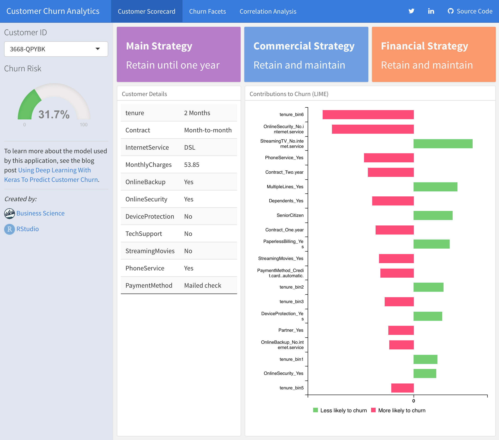

## keras-customer-churn

This repository contains a Shiny application that demonstrates the use of the customer churn model described in the [Using Deep Learning With Keras To Predict Customer Churn](https://tensorflow.rstudio.com/blog/keras-customer-churn.html) blog post.

{width=700 style="border: 1px solid #CCCCCC;"}

### Using the Application

To run the application, clone the repository then:

```r
rmarkdown::run("customer_churn.Rmd")
```

The shiny application has three tabs:

1) *Customer Scorecard*---Analyzes a single customer at a time. The [keras](https://keras.rstudio.com) model is used to return the probability of customer churn. The app then recommends three strategies to mitigate churn risk:
    - Main Strategy - Incorporates tenure, contract type, key services, monthly charges to recommend offerings that reduce churn risk
    - Commercial Strategy - Incorporates specific services that the customer may be interested in
    - Financial Strategy - Incoporates payment method recommendations to reduce churn

2) *Churn Facets*---Analyzes aggregate churn by various features including type of contract, revenue, tenure and internet service. Drop-box filters are available to subset the data and drill into important customer segments. 
3) *Correlation Analysis*---The correlation analysis shows the features that correlate to churn, which is important for a global perspective of understanding what affects churn.

### Training the Model

Use the `customer_churn.R` script to train the model used by the application from scratch:

```{r}
source("customer_churn.R")
```


