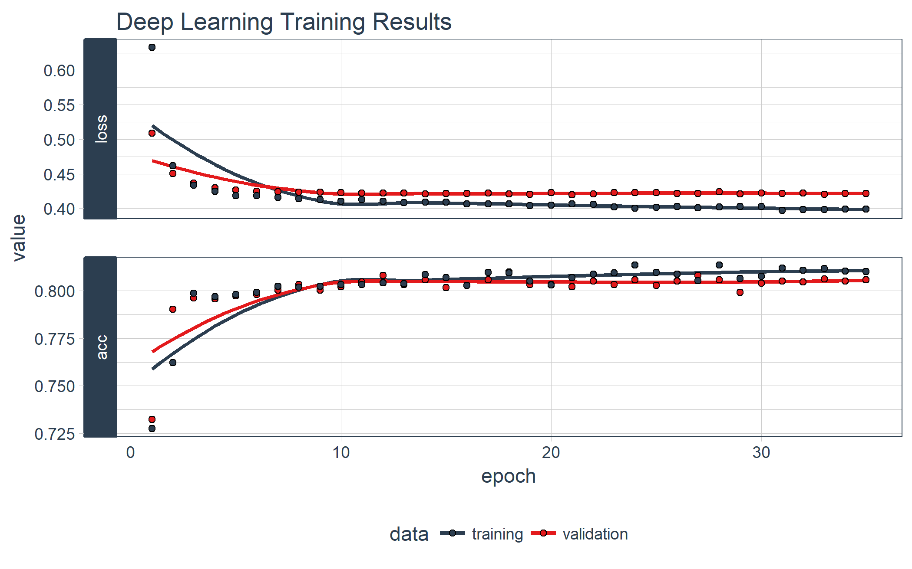
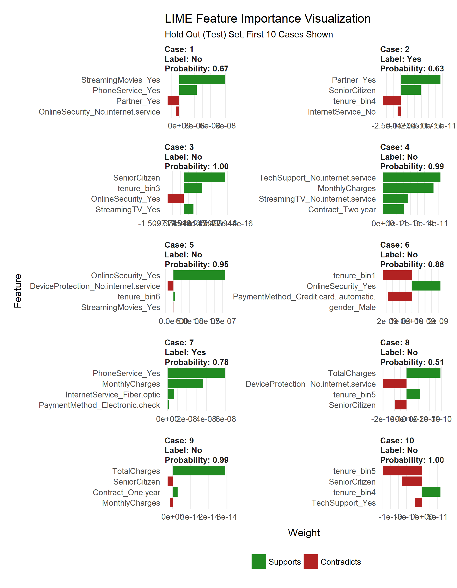
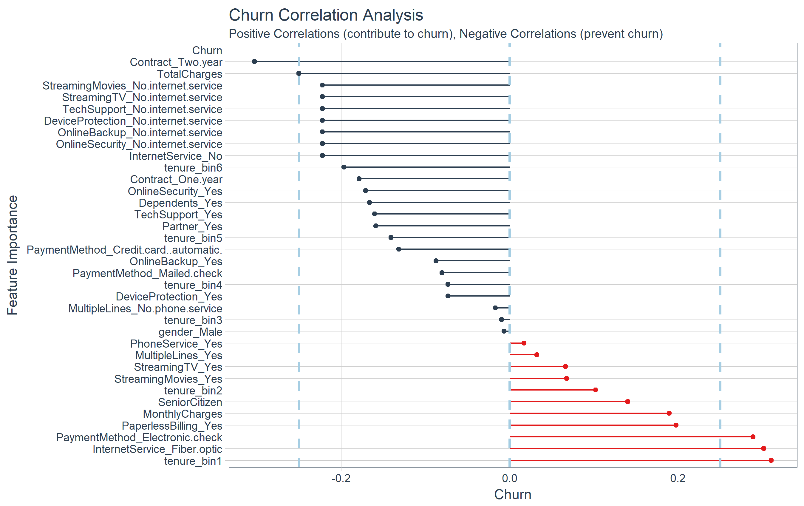

```{r setup, include=FALSE}
knitr::opts_chunk$set(
    echo = TRUE,
    message = F,
    warning = F,
    fig.width  = 8,
    dpi = 200
    )
```

__Customer churn is a problem that all companies need to monitor, especially those that depend on subscription-based revenue streams__. The simple fact is that most organizations have data that can be used to target these individuals and to understand the key drivers of churn, and __we now have Keras for Deep Learning available in R (Yes, in R!!), which predicted customer churn with 82% accuracy__. We're super excited for this article because we are using the new [`keras`](https://tensorflow.rstudio.com/keras/) package to produce an __Artificial Neural Network (ANN)__ model on the [IBM Watson Telco Customer Churn Data Set](https://www.ibm.com/communities/analytics/watson-analytics-blog/predictive-insights-in-the-telco-customer-churn-data-set/)! As for most business problems, it's equally important to __explain what features drive the model__, which is why we'll use the [`lime`](https://github.com/thomasp85/lime) package for explainability. We cross-checked the LIME results with a Correlation Analysis using the [`corrr`](https://github.com/drsimonj/corrr) package. We're not done yet. In addition, we use __three new packages to assist with Machine Learning (ML)__: [`recipes`](https://topepo.github.io/recipes) for preprocessing, [`rsample`](https://topepo.github.io/rsample/) for sampling data and [`yardstick`](https://github.com/topepo/yardstick) for model metrics. These are relatively new additions to CRAN developed by [Max Kuhn](https://github.com/topepo) at RStudio (creator of the [`caret`](http://topepo.github.io/caret/index.html) package). It seems that _R is quickly developing ML tools that rival Python_. Good news if you're interested in applying Deep Learning in R! We are so let's get going!! 

## Customer Churn: Hurts Sales, Hurts Company

Customer churn refers to the situation when a customer ends their relationship with a company, and it's a costly problem. Customers are the fuel that powers a business. Loss of customers impacts sales. Further, it's much more difficult and costly to gain new customers than it is to retain existing customers. As a result, __organizations need to focus on reducing customer churn__.


The good news is that __machine learning can help__. For many businesses that offer subscription based services, it's critical to both predict customer churn and explain what features relate to customer churn. Older techniques such as logistic regression can be less accurate than newer techniques such as deep learning, which is why __we are going to show you how to model an ANN in R with the [`keras`](https://tensorflow.rstudio.com/keras/) package__. 


## Churn Modeling With Artificial Neural Networks (Keras)

Artificial Neural Networks (ANN) are now a staple within the sub-field of Machine Learning called Deep Learning. __Deep learning algorithms can be vastly superior to traditional regression and classification methods__ (e.g. linear and logistic regression) because of the ability to model interactions between features that would otherwise go undetected. The challenge becomes explainability, which is often needed to support the business case. The good news is we get the best of both worlds with `keras` and `lime`.

### IBM Watson Dataset (Where We Got The Data)

The dataset used for this tutorial is [IBM Watson Telco Dataset]( https://www.ibm.com/communities/analytics/watson-analytics-blog/predictive-insights-in-the-telco-customer-churn-data-set/). According to IBM, the business challenge is...

> A telecommunications company [Telco] is concerned about the number of customers leaving their landline business for cable competitors. They need to understand who is leaving. Imagine that you’re an analyst at this company and you have to find out who is leaving and why.

The dataset includes information about:

- __Customers who left within the last month__: The column is called Churn
- __Services that each customer has signed up for__: phone, multiple lines, internet, online security, online backup, device protection, tech support, and streaming TV and movies
- __Customer account information__: how long they’ve been a customer, contract, payment method, paperless billing, monthly charges, and total charges
- __Demographic info about customers__: gender, age range, and if they have partners and dependents

### Deep Learning With Keras (What We Did With The Data)

In this example we show you how to use [`keras`](https://tensorflow.rstudio.com/keras/) to develop a sophisticated and highly accurate deep learning model in R. We walk you through the preprocessing steps, investing time into how to format the data for Keras. We inspect the various classification metrics, and show that __an un-tuned ANN model can easily get 82% accuracy on the unseen data__. Here's the deep learning training history visualization.



We have some fun with preprocessing the data (_yes, preprocessing can actually be fun and easy!_). We use the new [`recipes`](https://topepo.github.io/recipes) package to simplify the preprocessing workflow. 

We end by showing you how to explain the ANN with the [`lime`](https://github.com/thomasp85/lime) package. __Neural networks used to be frowned upon because of the "black box" nature__ meaning these sophisticated models (ANNs are highly accurate) are difficult to explain using traditional methods. __Not any more with LIME!__ Here's the feature importance visualization.




We also cross-checked the LIME results with a __Correlation Analysis__ using the [`corrr`](https://github.com/drsimonj/corrr) package. Here's the correlation visualization.



We even built an __ML-Powered Interactive PowerBI Web Application__ with a __Customer Scorecard__ to monitor customer churn risk and to make recommendations on how to improve customer health! Feel free to take it for a spin.

<p style="text-align: center;"><em>View in Full Screen Mode for best experience</em></p>

<iframe width="100%" height="600" src="https://app.powerbi.com/view?r=eyJrIjoiNzRhNGI4M2YtZTZhNy00ZjUwLTllM2MtOWVkNDVmOWMzM2I0IiwidCI6IjkxYzM2OWI1LTFjOWUtNDM5Yy05ODljLTE4NjdlYzYwNjYwMyIsImMiOjZ9" frameborder="1" allowFullScreen="true"></iframe>

### Credits 

We saw that just last week the same Telco customer churn dataset was used in the article, [Predict Customer Churn – Logistic Regression, Decision Tree and Random Forest](https://datascienceplus.com/predict-customer-churn-logistic-regression-decision-tree-and-random-forest/). We thought the article was excellent. 

This article takes a different approach with Keras, LIME, Correlation Analysis, and a few other cutting edge packages. We encourage the readers to check out both articles because, although the problem is the same, both solutions are beneficial to those learning data science and advanced modeling.


## Prerequisites

We use the following libraries in this tutorial:

- [`keras`](https://tensorflow.rstudio.com/keras/): Library that ports Keras from Python enabling deep learning in R. Visit the [documentation](https://tensorflow.rstudio.com/keras/) for more information.
- [`lime`](https://github.com/thomasp85/lime): Used to explain the predictions of black box classifiers. Deep Learning falls into this category.
- [`tidyquant`](https://business-science.github.io/tidyquant/): Loads the [`tidyverse`](https://www.tidyverse.org/) ([`dplyr`](http://dplyr.tidyverse.org), [`ggplot2`](http://ggplot2.tidyverse.org), etc) and has nice visualization functions with [`theme_tq()`](https://business-science.github.io/tidyquant/reference/theme_tq.html). Visit the [tidyquant documentation](https://business-science.github.io/tidyquant/) and the [tidyverse documentation](https://www.tidyverse.org/) for more information on the individual packages.
- [`rsample`](https://topepo.github.io/rsample/): New package for generating resamples. Visit the [documentation](https://topepo.github.io/rsample/) for more information.
- [`recipes`](https://topepo.github.io/recipes): New package for preprocessing machine learning data sets. Visit the [documentation](https://topepo.github.io/recipes/) for more information.
- [`yardstick`](https://github.com/topepo/yardstick): Tidy methods for measuring model performance. Visit the [GitHub Page](https://github.com/topepo/yardstick) for more information.
- [`corrr`](https://github.com/drsimonj/corrr): Tidy methods for correlation. Visit the [GitHub Page](https://github.com/drsimonj/corrr) for more information.

Install the following packages with `install.packages()`.

```{r, eval = F}
pkgs <- c("keras", "lime", "tidyquant", "rsample", "recipes", "yardstick", "corrr")
install.packages(pkgs)
```


## Load Libraries

Load the libraries. 

```{r}
# Load libraries
library(keras)
library(lime)
library(tidyquant)
library(rsample)
library(recipes)
library(yardstick)
library(corrr)
```

If you have not previously run Keras in R, you will need to install Keras using the [`install_keras()`](https://tensorflow.rstudio.com/keras/reference/install_keras.html) function.

```{r, eval=F}
# Install Keras if you have not installed before
install_keras()
```


## Import Data

Download the [IBM Watson Telco Data Set here](https://www.ibm.com/communities/analytics/watson-analytics-blog/predictive-insights-in-the-telco-customer-churn-data-set/). Next, use `read_csv()` to import the data into a nice tidy data frame. We use the [`glimpse()`](http://tibble.tidyverse.org/reference/glimpse.html) function to quickly inspect the data. We have the target "Churn" and all other variables are potential predictors. The raw data set needs to be cleaned and preprocessed for ML. 

```{r, eval=F}
# Import data
churn_data_raw <- read_csv("WA_Fn-UseC_-Telco-Customer-Churn.csv")

glimpse(churn_data_raw)
```

```{r, echo=F}
# Import data
churn_data_raw <- read_csv("2017-11-28_customer_churn_keras/data/WA_Fn-UseC_-Telco-Customer-Churn.csv")

glimpse(churn_data_raw)
```

## Preprocess Data

We'll go through a few steps to preprocess the data for ML. First, we "prune" the data, which is nothing more than removing unnecessary columns and rows. Then we split into training and testing sets. After that we explore the training set to uncover transformations that will be needed for deep learning. We save the best for last. We end by preprocessing the data with the new [`recipes`](https://topepo.github.io/recipes) package. 

### Prune The Data

The data has a few columns and rows we'd like to remove:

- The "customerID" column is a unique identifier for each observation that isn't needed for modeling. We can de-[`select`](http://dplyr.tidyverse.org/reference/select.html) this column.
- The data has 11 `NA` values all in the "TotalCharges" column. Because it's such a small percentage of the total population (99.8% complete cases), we can drop these observations with the [`drop_na()`](http://tidyr.tidyverse.org/reference/drop_na.html) function from [`tidyr`](http://tidyr.tidyverse.org). Note that these may be customers that have not yet been charged, and therefore an alternative is to replace with zero or -99 to segregate this population from the rest. 
- My preference is to have the target in the first column so we'll include a final [`select`](http://dplyr.tidyverse.org/reference/select.html) operation to do so. 

We'll perform the cleaning operation with one tidyverse pipe (%>%) chain. 

```{r}
# Remove unnecessary data
churn_data_tbl <- churn_data_raw %>%
    select(-customerID) %>%
    drop_na() %>%
    select(Churn, everything())
    
glimpse(churn_data_tbl)
```


### Split Into Train/Test Sets

We have a new package, [`rsample`](https://topepo.github.io/rsample/), which is very useful for sampling methods. It has the [`initial_split()`](https://topepo.github.io/rsample/reference/initial_split.html) function for splitting data sets into training and testing sets. The return is a special `rsplit` object. 

```{r}
# Split test/training sets
set.seed(100)
train_test_split <- initial_split(churn_data_tbl, prop = 0.8)
train_test_split
```

We can retrieve our training and testing sets using [`training()`](https://topepo.github.io/rsample/reference/initial_split.html) and [`testing()`](https://topepo.github.io/rsample/reference/initial_split.html) functions.

```{r}
# Retrieve train and test sets
train_tbl <- training(train_test_split)
test_tbl  <- testing(train_test_split) 
```


### Exploration: What Transformation Steps Are Needed For ML?

This phase of the analysis is often called exploratory analysis, but basically __we are trying to answer the question, "What steps are needed to prepare for ML?" The key concept is knowing what transformations are needed to run the algorithm most effectively__. Artificial Neural Networks are best when the data is one-hot encoded, scaled and centered. In addition, other transformations may be beneficial as well to make relationships easier for the algorithm to identify. A full exploratory analysis is not practical in this article. With that said we'll cover a few tips on transformations that can help as they relate to this dataset. In the next section, we will implement the preprocessing techniques.


#### Discretize The "tenure" Feature

Numeric features like age, years worked, length of time in a position can generalize a group (or cohort). We see this in marketing a lot (think "millennials", which identifies a group born in a certain timeframe). The "tenure" feature falls into this category of numeric features that can be discretized into groups. 

```{r, echo=F, fig.height=3.5}
# Investigate Tenure
train_tbl %>%
    group_by(tenure) %>%
    summarize(count = n()) %>%
    ggplot(aes(x = tenure, y = count)) +
    geom_bar(stat = "identity", color = "white", fill = palette_light()[[1]]) +
    theme_tq() +
    expand_limits(y = 0) + 
    labs(title = "Tenure Counts Without Binning",
         x = "tenure (months)")
```

We can split into six cohorts that divide up the user base by tenure in roughly one year (12 month) increments. This should help the ML algorithm detect if a group is more/less susceptible to customer churn.

```{r, echo=F, fig.height=3.5}
# Investigate Tenure
train_tbl %>%
    ggplot(aes(tenure)) +
    geom_histogram(bins = 6, color = "white", fill = palette_light()[[1]]) +
    theme_tq() +
    labs(title = "Tenure Counts With Six Bins")
```

#### Transform The "TotalCharges" Feature

What we don't like to see is when a lot of observations are bunched within a small part of the range. 

```{r, echo=F, fig.height=3.5}
# Investigate TotalCharges
train_tbl %>%
    ggplot(aes(TotalCharges)) +
    geom_histogram(bins = 100, color = "white", fill = palette_light()[[1]]) +
    theme_tq() +
    labs(title = "TotalCharges Histogram, 100 Bins")
```

We can use a log transformation to even out the data into more of a normal distribution. It's not perfect, but it's quick and easy to get our data spread out a bit more.

```{r, fig.height=3.5, echo=F}
# Log Transform TotalCharges
train_tbl %>%
    ggplot(aes(log(TotalCharges))) +
    geom_histogram(bins = 100, color = "white", fill = palette_light()[[1]]) +
    theme_tq() +
    labs(title = "Log(TotalCharges) Histogram, 100 Bins")
```

__Pro Tip: A quick test is to see if the log transformation increases the magnitude of the correlation__ between "TotalCharges" and "Churn". We'll use a few [`dplyr`](http://dplyr.tidyverse.org/) operations along with the [`corrr`](https://github.com/drsimonj/corrr) package to perform a quick correlation. 

- `correlate()`: Performs tidy correlations on numeric data
- `focus()`: Similar to `select()`. Takes columns and focuses on only the rows/columns of importance.
- `fashion()`: Makes the formatting aesthetically easier to read. 


```{r}
# Determine if log transformation improves correlation 
# between TotalCharges and Churn
train_tbl %>%
    select(Churn, TotalCharges) %>%
    mutate(
        Churn = Churn %>% as.factor() %>% as.numeric(),
        LogTotalCharges = log(TotalCharges)
        ) %>%
    correlate() %>%
    focus(Churn) %>%
    fashion()
```

The correlation between "Churn" and "LogTotalCharges" is greatest in magnitude indicating the log transformation should improve the accuracy of the ANN model we build. Therefore, we should perform the log transformation.

#### One-Hot Encoding

One-hot encoding is the process of converting categorical data to sparse data, which has columns of only zeros and ones (this is also called creating "dummy variables" or a "design matrix"). All non-numeric data will need to be converted to dummy variables. This is simple for binary Yes/No data because we can simply convert to 1's and 0's. It becomes slightly more complicated with multiple categories, which requires creating new columns of 1's and 0`s for each category (actually one less). We have four features that are multi-category: Contract, Internet Service, Multiple Lines, and Payment Method.

```{r, echo = F, fig.height=6}
# Features with multiple categories will be one-hot encoded 
train_tbl %>%
    select(MultipleLines, InternetService, Contract, PaymentMethod) %>%
    gather(key = key, value = value) %>%
    group_by(key, value) %>%
    summarize(count = n()) %>%
    ggplot(aes(value, count)) +
    geom_bar(stat = "identity", color = "white", fill = palette_light()[[1]]) +
    facet_wrap(~ key, ncol = 2, scales = "free") +
    theme_tq() +
    theme(axis.text.x = element_text(angle = 30, hjust = 1)) +
    labs(title = "Features with Multiple Categories: Need To Be One-Hot Encoded")
```

#### Feature Scaling

ANN's typically perform faster and often times with higher accuracy when the features are scaled and/or normalized (aka centered and scaled, also known as standardizing). Because ANNs use gradient descent, weights tend to update faster. According to [_Sebastian Raschka_](https://sebastianraschka.com/), an expert in the field of Deep Learning, several examples when feature scaling is important are:

> - k-nearest neighbors with an Euclidean distance measure if want all features to contribute equally
> - k-means (see k-nearest neighbors) 
> - logistic regression, SVMs, perceptrons, neural networks etc. if you are using gradient descent/ascent-based optimization, otherwise some weights will update much faster than others
> - linear discriminant analysis, principal component analysis, kernel principal component analysis since you want to find directions of maximizing the variance (under the constraints that those directions/eigenvectors/principal components are orthogonal); you want to have features on the same scale since you’d emphasize variables on “larger measurement scales” more. There are many more cases than I can possibly list here … I always recommend you to think about the algorithm and what it’s doing, and then it typically becomes obvious whether we want to scale your features or not.


The interested reader can read [Sebastian Raschka's article](http://sebastianraschka.com/Articles/2014_about_feature_scaling.html) for a full discussion on the scaling/normalization topic. __Pro Tip: When in doubt, standardize the data__.


### Preprocessing With Recipes

Let's implement the preprocessing steps/transformations uncovered during our exploration. Max Kuhn (creator of [`caret`](http://topepo.github.io/caret/index.html)) has been putting some work into _Rlang ML tools_ lately, and the payoff is beginning to take shape. __A new package, [`recipes`](https://topepo.github.io/recipes), makes creating ML data preprocessing workflows a breeze__! It takes a little getting used to, but I've found that it really helps manage the preprocessing steps. We'll go over the nitty gritty as it applies to this problem. 

#### Step 1: Create A Recipe 

A "recipe" is nothing more than a series of steps you would like to perform on the training, testing and/or validation sets. Think of preprocessing data like baking a cake (I'm not a baker but stay with me). The recipe is our steps to make the cake. It doesn't do anything other than create the playbook for baking. 

We use the [`recipe()`](https://topepo.github.io/recipes/reference/recipe.html) function to implement our preprocessing steps. The function takes a familiar `object` argument, which is a modeling function such as `object = Churn ~ .` meaning "Churn" is the outcome (aka response, predictor, target) and all other features are predictors. The function also takes the `data` argument, which gives the "recipe steps" perspective on how to apply during baking (next). 

A recipe is not very useful until we add "steps", which are used to transform the data during baking. The package contains a number of useful "step functions" that can be applied. The entire list of [Step Functions](https://topepo.github.io/recipes/reference/index.html) can be viewed here. For our model, we use:

1. [`step_discretize()`](https://topepo.github.io/recipes/reference/discretize.html) with the `option = list(cuts = 6)` to cut the continuous variable for "tenure" (number of years as a customer) to group customers into cohorts.
2. [`step_log()`](https://topepo.github.io/recipes/reference/step_log.html) to log transform "TotalCharges".
3. [`step_dummy()`](https://topepo.github.io/recipes/reference/step_dummy.html) to one-hot encode the categorical data. Note that this adds columns of one/zero for categorical data with three or more categories.
4. [`step_center()`](https://topepo.github.io/recipes/reference/step_center.html) to mean-center the data.
5. [`step_scale()`](https://topepo.github.io/recipes/reference/step_scale.html) to scale the data.

The last step is to prepare the recipe with the [`prep()`](https://topepo.github.io/recipes/reference/prep.html) function. This step is used to "estimate the required parameters from a training set that can later be applied to other data sets". This is important for centering and scaling and other functions that use parameters defined from the training set.  

__Here's how simple it is to implement the preprocessing steps that we went over!__ 

```{r}
# Create recipe
rec_obj <- recipe(Churn ~ ., data = train_tbl) %>%
    step_discretize(tenure, options = list(cuts = 6)) %>%
    step_log(TotalCharges) %>%
    step_dummy(all_nominal(), -all_outcomes()) %>%
    step_center(all_predictors(), -all_outcomes()) %>%
    step_scale(all_predictors(), -all_outcomes()) %>%
    prep(data = train_tbl)
```

We can print the recipe object if we ever forget what steps were used to prepare the data. __Pro Tip: We can save the recipe object as an RDS file using `saveRDS()`, and then use it to `bake()` (discussed next) future raw data into ML-ready data in production!__

```{r}
# Print the recipe object
rec_obj
```


#### Step 2: Baking With Your Recipe

Now for the fun part! We can apply the "recipe" to any data set with the [`bake()`](https://topepo.github.io/recipes/reference/bake.html) function, and it processes the data following our recipe steps. We'll apply to our training and testing data to convert from raw data to a machine learning dataset. Check our training set out with [`glimpse()`](http://tibble.tidyverse.org/reference/glimpse.html). __Now that's an ML-ready dataset prepared for ANN modeling!!__ 

```{r}
# Predictors
x_train_tbl <- bake(rec_obj, newdata = train_tbl) %>% select(-Churn)
x_test_tbl  <- bake(rec_obj, newdata = test_tbl) %>% select(-Churn)

glimpse(x_train_tbl)
```

#### Step 3: Don't Forget The Target

One last step, we need to store the actual values (truth) as `y_train_vec` and `y_test_vec`, which are needed for modeling our ANN. We convert to a series of numeric ones and zeros which can be accepted by the Keras ANN modeling functions. We add "vec" to the name so we can easily remember the class of the object (it's easy to get confused when working with tibbles, vectors, and matrix data types).

```{r}
# Response variables for training and testing sets
y_train_vec <- ifelse(pull(train_tbl, Churn) == "Yes", 1, 0)
y_test_vec  <- ifelse(pull(test_tbl, Churn) == "Yes", 1, 0)
```

## Model Customer Churn With Keras (Deep Learning)

__This is super exciting!! Finally, Deep Learning with Keras in R!__ The team at RStudio has done fantastic work recently to create the [`keras`](https://tensorflow.rstudio.com/keras/) package, which implements [Keras](https://keras.io/) in R. Very cool!

### Background On Artifical Neural Networks

For those unfamiliar with Neural Networks (and those that need a refresher), [read this article](https://www.xenonstack.com/blog/overview-of-artificial-neural-networks-and-its-applications). It's very comprehensive, and you'll leave with a general understanding of the types of deep learning and how they work.


<p class="text-center date">Source: <a href="https://www.xenonstack.com/blog/overview-of-artificial-neural-networks-and-its-applications">Xenon Stack</a></p>

Deep Learning has been available in R for some time, but the primary packages used in the wild have not (this includes Keras, Tensor Flow, Theano, etc, which are all Python libraries). It's worth mentioning that a number of other Deep Learning packages exist in R including `h2o`, `mxnet`, and others. The interested reader can check out [this blog post for a comparison of deep learning packages in R](http://www.rblog.uni-freiburg.de/2017/02/07/deep-learning-in-r/).

### Building A Deep Learning Model

We're going to build a special class of ANN called a [Multi-Layer Perceptron (MLP)](https://en.wikipedia.org/wiki/Multilayer_perceptron). MLPs are one of the simplest forms of deep learning, but they are both highly accurate and serve as a jumping-off point for more complex algorithms. MLPs are quite versatile as they can be used for regression, binary and multi classification (and are typically quite good at classification problems). 

We'll build a three layer MLP with Keras. Let's walk-through the steps before we implement in R. 

1. __Initialize a sequential model__: The first step is to initialize a sequential model with [`keras_model_sequential()`](https://tensorflow.rstudio.com/keras/reference/keras_model_sequential.html), which is the beginning of our Keras model. The sequential model is composed of a linear stack of layers.

2. __Apply layers to the sequential model__: Layers consist of the input layer, hidden layers and an output layer. The input layer is the data and provided it's formatted correctly there's nothing more to discuss. The hidden layers and output layers are what controls the ANN inner workings.

    - __Hidden Layers__: Hidden layers form the neural network nodes that enable non-linear activation using weights. The hidden layers are created using [`layer_dense()`](https://tensorflow.rstudio.com/keras/reference/layer_dense.html). We'll add two hidden layers. We'll apply `units = 16`, which is the number of nodes. We'll select `kernel_initializer = "uniform"` and `activation = "relu"` for both layers. The first layer needs to have the `input_shape = 35`, which is the number of columns in the training set. __Key Point: While we are arbitrarily selecting the number of hidden layers, units, kernel initializers and activation functions, these parameters can be optimized through a process called hyperparameter tuning that is discussed in [Next Steps](#next-steps)__.
    
    - __Dropout Layers__: Dropout layers are used to control overfitting. This eliminates weights below a cutoff threshold to prevent low weights from overfitting the layers. We use the [`layer_dropout()`](https://tensorflow.rstudio.com/keras/reference/layer_dropout.html) function add two drop out layers with `rate = 0.10` to remove weights below 10%.
    
    - __Output Layer__: The output layer specifies the shape of the output and the method of assimilating the learned information. The output layer is applied using the [`layer_dense()`](https://tensorflow.rstudio.com/keras/reference/layer_dense.html). For binary values, the shape should be `units = 1`. For multi-classification, the `units` should correspond to the number of classes. We set the `kernel_initializer = "uniform"` and the `activation = "sigmoid"` (common for binary classification). 


3. __Compile the model__: The last step is to compile the model with [`compile()`](https://tensorflow.rstudio.com/keras/reference/compile.html). We'll use `optimizer = "adam"`, which is one of the most popular optimization algorithms. We select `loss = "binary_crossentropy"` since this is a binary classification problem. We'll select `metrics = c("accuracy")` to be evaluated during training and testing. __Key Point: The optimizer is often included in the tuning process__.

Let's codify the discussion above to build our Keras MLP-flavored ANN model. 

```{r}
# Building our Artificial Neural Network
model_keras <- keras_model_sequential()

model_keras %>% 
    # First hidden layer
    layer_dense(
        units              = 16, 
        kernel_initializer = "uniform", 
        activation         = "relu", 
        input_shape        = ncol(x_train_tbl)) %>% 
    # Dropout to prevent overfitting
    layer_dropout(rate = 0.1) %>%
    # Second hidden layer
    layer_dense(
        units              = 16, 
        kernel_initializer = "uniform", 
        activation         = "relu") %>% 
    # Dropout to prevent overfitting
    layer_dropout(rate = 0.1) %>%
    # Output layer
    layer_dense(
        units              = 1, 
        kernel_initializer = "uniform", 
        activation         = "sigmoid") %>% 
    # Compile ANN
    compile(
        optimizer = 'adam',
        loss      = 'binary_crossentropy',
        metrics   = c('accuracy')
    )
model_keras
```


We use the [`fit()`](https://tensorflow.rstudio.com/keras/reference/fit.html) function to run the ANN on our training data. The `object` is our model, and `x` and `y` are our training data in matrix and numeric vector forms, respectively. The `batch_size = 50` sets the number samples per gradient update within each epoch. We set `epochs = 35` to control the number training cycles. Typically we want to keep the batch size high since this decreases the error within each training cycle (epoch). We also want epochs to be large, which is important in visualizing the training history (discussed below). We set `validation_split = 0.30` to include 30% of the data for model validation, which prevents overfitting. The training process should complete in 15 seconds or so.

```{r, eval = F}
# Fit the keras model to the training data
fit_keras <- fit(
    object           = model_keras, 
    x                = as.matrix(x_train_tbl), 
    y                = y_train_vec,
    batch_size       = 50, 
    epochs           = 35,
    validation_split = 0.30
    )
```


```{r, echo = F}
# saveRDS(object = fit_keras, file = "models/fit_keras.RDS")
fit_keras <- readRDS("2017-11-28_customer_churn_keras/models/fit_keras.RDS")
```


We can inspect the final model. We want to make sure there is minimal difference between the validation accuracy and the training accuracy. 

```{r}
# Print the final model
fit_keras
```

We can visualize the Keras training history using the [`plot()`](https://tensorflow.rstudio.com/keras/reference/plot.keras_training_history.html) function. What we want to see is the validation accuracy and loss leveling off, which means the model has completed training. We see that there is some divergence between training loss/accuracy and validation loss/accuracy. This model indicates we can possibly stop training at an earlier epoch. __Pro Tip: Only use enough epochs to get a high validation accuracy. Once validation accuracy curve begins to flatten or decrease, it's time to stop training.__

```{r}
# Plot the training/validation history of our Keras model
plot(fit_keras) +
    theme_tq() +
    scale_color_tq() +
    scale_fill_tq() +
    labs(title = "Deep Learning Training Results")
```


### Making Predictions

We've got a good model based on the validation accuracy. Now let's make some predictions from our [`keras`](https://tensorflow.rstudio.com/keras/) model on the test data set, which was unseen during modeling (we use this for the true performance assessment). We have two functions to generate predictions:

- [`predict_classes`](https://tensorflow.rstudio.com/keras/reference/predict_proba.html): Generates class values as a matrix of ones and zeros. Since we are dealing with binary classification, we'll convert the output to a vector.
- [`predict_proba`](https://tensorflow.rstudio.com/keras/reference/predict_proba.html): Generates the class probabilities as a numeric matrix indicating the probability of being a class. Again, we convert to a numeric vector because there is only one column output. 

```{r, eval = F}
# Predicted Class
yhat_keras_class_vec <- predict_classes(object = model_keras, x = as.matrix(x_test_tbl)) %>%
    as.vector()

# Predicted Class Probability
yhat_keras_prob_vec  <- predict_proba(object = model_keras, x = as.matrix(x_test_tbl)) %>%
    as.vector()
```

```{r, echo=F}
# saveRDS(yhat_keras_class_vec, "models/yhat_keras_class_vec.RDS")
# saveRDS(yhat_keras_prob_vec, "models/yhat_keras_prob_vec.RDS")
yhat_keras_class_vec <- readRDS("2017-11-28_customer_churn_keras/models/yhat_keras_class_vec.RDS")
yhat_keras_prob_vec <- readRDS("2017-11-28_customer_churn_keras/models/yhat_keras_prob_vec.RDS")
```


## Inspect Performance With Yardstick

The `yardstick` package has a collection of handy functions for measuring performance of machine learning models. We'll overview some metrics we can use to understand the performance of our model. 

First, let's get the data formatted for `yardstick`. We create a data frame with the truth (actual values as factors), estimate (predicted values as factors), and the class probability (probability of yes as numeric). We use the [`fct_recode()`](http://forcats.tidyverse.org/reference/fct_recode.html) function from the [`forcats`](http://forcats.tidyverse.org) package to assist with recoding as Yes/No values. 

```{r}
# Format test data and predictions for yardstick metrics
estimates_keras_tbl <- tibble(
    truth      = as.factor(y_test_vec) %>% fct_recode(yes = "1", no = "0"),
    estimate   = as.factor(yhat_keras_class_vec) %>% fct_recode(yes = "1", no = "0"),
    class_prob = yhat_keras_prob_vec
)

estimates_keras_tbl
```

Now that we have the data formatted, we can take advantage of the `yardstick` package. The only other thing we need to do is to set `options(yardstick.event_first = FALSE)`. As pointed out by [ad1729](https://github.com/ad1729) in [GitHub Issue 13](options(yardstick.event_first = FALSE)), the default is to classify 0 as the positive class instead of 1. 

```{r}
options(yardstick.event_first = FALSE)
```


#### Confusion Table

We can use the `conf_mat()` function to get the confusion table. We see that the model was by no means perfect, but it did a decent job of identifying customers likely to churn. 

```{r}
# Confusion Table
estimates_keras_tbl %>% conf_mat(truth, estimate)
```


#### Accuracy

We can use the `metrics()` function to get an accuracy measurement from the test set. We are getting roughly 82% accuracy.

```{r}
# Accuracy
estimates_keras_tbl %>% metrics(truth, estimate)
```

#### AUC

We can also get the ROC Area Under the Curve (AUC) measurement. AUC is often a good metric used to compare different classifiers and to compare to randomly guessing (AUC_random = 0.50). Our model has AUC = 0.85, which is much better than randomly guessing. Tuning and testing different classification algorithms may yield even better results. 

```{r}
# AUC
estimates_keras_tbl %>% roc_auc(truth, class_prob)
```

#### Precision And Recall

Precision is when the model predicts "yes", how often is it actually "yes". Recall (also true positive rate or specificity) is when the actual value is "yes" how often is the model correct. We can get `precision()` and `recall()` measurements using `yardstick`.

```{r}
# Precision
tibble(
    precision = estimates_keras_tbl %>% precision(truth, estimate),
    recall    = estimates_keras_tbl %>% recall(truth, estimate)
)
```

Precision and recall are very important to the business case: The organization is concerned with __balancing the cost of targeting and retaining customers at risk of leaving with the cost of inadvertently targeting customers that are not planning to leave__ (and potentially decreasing revenue from this group). The threshold above which to predict Churn = "Yes" can be adjusted to optimize for the business problem. This becomes an __Customer Lifetime Value optimization problem__ that is discussed further in [Next Steps](#next-steps).


#### F1 Score

We can also get the F1-score, which is a weighted average between the precision and recall. Machine learning classifier thresholds are often adjusted to maximize the F1-score. However, this is often not the optimal solution to the business problem. 

```{r}
# F1-Statistic
estimates_keras_tbl %>% f_meas(truth, estimate, beta = 1)
```


## Explain The Model With LIME

LIME stands for _Local Interpretable Model-agnostic Explanations_, and is a method for explaining black-box machine learning model classifiers. For those new to LIME, this YouTube video does a really nice job explaining how LIME helps to identify feature importance with black box machine learning models (e.g. deep learning, stacked ensembles, random forest). 

<iframe width="100%" height="500" align="center" src="https://www.youtube.com/embed/hUnRCxnydCc" frameborder="1" allowfullscreen></iframe>

#### Setup

The [`lime`](https://github.com/thomasp85/lime) package implements [LIME](https://github.com/marcotcr/lime) in R. One thing to note is that it's not setup out-of-the-box to work with `keras`. The good news is with a few functions we can get everything working properly. We'll need to make two custom functions:

* `model_type`: Used to tell `lime` what type of model we are dealing with. It could be classification, regression, survival, etc.

* `predict_model`: Used to allow `lime` to perform predictions that its algorithm can interpret.

The first thing we need to do is identify the class of our model object. We do this with the `class()` function.

```{r}
class(model_keras)
```

Next we create our `model_type()` function. It's only input is `x` the keras model. The function simply returns "classification", which tells LIME we are classifying. 

```{r}
# Setup lime::model_type() function for keras
model_type.keras.models.Sequential <- function(x, ...) {
    return("classification")
}
```

Now we can create our `predict_model()` function, which wraps `keras::predict_proba()`. The trick here is to realize that it's inputs must be `x` a model, `newdata` a dataframe object (this is important), and `type` which is not used but can be use to switch the output type. The output is also a little tricky because it _must be in the format of probabilities by classification_ (this is important; shown next). 

```{r}
# Setup lime::predict_model() function for keras
predict_model.keras.models.Sequential <- function(x, newdata, type, ...) {
    pred <- predict_proba(object = x, x = as.matrix(newdata))
    return(data.frame(Yes = pred, No = 1 - pred))
}
```

Run this next script to show you what the output looks like and to test our `predict_model()` function. See how it's the probabilities by classification. It must be in this form for `model_type = "classification"`.

```{r, eval = F}
# Test our predict_model() function
predict_model(x = model_keras, newdata = x_test_tbl, type = 'raw') %>%
    tibble::as_tibble()
```

```{r, echo=F}
# predict_model_tbl <- predict_model(x = model_keras, newdata = x_test_tbl, type = 'raw') %>% tibble::as_tibble()
# saveRDS(predict_model_tbl, "models/predict_model_tbl.RDS")
readRDS("2017-11-28_customer_churn_keras/models/predict_model_tbl.RDS")
```


Now the fun part, we create an explainer using the `lime()` function. Just pass the training data set without the "Attribution column". The form must be a data frame, which is OK since our `predict_model` function will switch it to an `keras` object. Set `model = automl_leader` our leader model, and `bin_continuous = FALSE`. We could tell the algorithm to bin continuous variables, but this may not make sense for categorical numeric data that we didn't change to factors. 

```{r, eval = F}
# Run lime() on training set
explainer <- lime::lime(
    x              = x_train_tbl, 
    model          = model_keras, 
    bin_continuous = FALSE)
```

Now we run the `explain()` function, which returns our `explanation`. This can take a minute to run so we limit it to just the first ten rows of the test data set. We set `n_labels = 1` because we care about explaining a single class. Setting `n_features = 4` returns the top four features that are critical to each case. Finally, setting `kernel_width = 0.5` allows us to increase the "model_r2" value by shrinking the localized evaluation. 

```{r, eval=F}
# Run explain() on explainer
explanation <- lime::explain(
    x_test_tbl[1:10, ], 
    explainer    = explainer, 
    n_labels     = 1, 
    n_features   = 4,
    kernel_width = 0.5)
```

```{r, echo=F}
# saveRDS(explanation, file = "models/explantion.RDS")
explanation <- readRDS(file = "2017-11-28_customer_churn_keras/models/explantion.RDS")
```


#### Feature Importance Visualization

The payoff for the work we put in using LIME is this __feature importance plot__. This allows us to visualize each of the first ten cases (observations) from the test data. The top four features for each case are shown. Note that they are not the same for each case. The green bars mean that the feature supports the model conclusion, and the red bars contradict. A few important features based on frequency in first ten cases:

- Tenure (7 cases)
- Senior Citizen (5 cases)
- Online Security (4 cases)

```{r, fig.height=8}
plot_features(explanation) +
    labs(title = "LIME Feature Importance Visualization",
         subtitle = "Hold Out (Test) Set, First 10 Cases Shown")
```

Another excellent visualization can be performed using `plot_explanations()`, which produces a facetted heatmap of all case/label/feature combinations. It's a more condensed version of `plot_features()`, but we need to be careful because it does not provide exact statistics and it makes it less easy to investigate binned features (Notice that "tenure" would not be identified as a contributor even though it shows up as a top feature in 7 of 10 cases).

```{r, fig.height=7}
plot_explanations(explanation) +
    labs(title = "LIME Feature Importance Heatmap",
         subtitle = "Hold Out (Test) Set, First 10 Cases Shown")
```

## Check Explanations With Correlation Analysis

One thing we need to be careful with the LIME visualization is that we are only doing a sample of the data, in our case the first 10 test observations. Therefore, we are gaining a very localized understanding of how the ANN works. However, we also want to know on from a global perspective what drives feature importance. 

We can perform a __correlation analysis__ on the training set as well to help glean what features correlate globally to "Churn". We'll use the `corrr` package, which performs tidy correlations with the function `correlate()`. We can get the correlations as follows.

```{r}
# Feature correlations to Churn
corrr_analysis <- x_train_tbl %>%
    mutate(Churn = y_train_vec) %>%
    correlate() %>%
    focus(Churn) %>%
    rename(feature = rowname) %>%
    arrange(abs(Churn)) %>%
    mutate(feature = as_factor(feature)) 
corrr_analysis
```

The correlation visualization helps in distinguishing which features are relavant to Churn.  

```{r, fig.height=7}
# Correlation visualization
corrr_analysis %>%
    ggplot(aes(x = Churn, y = fct_reorder(feature, desc(Churn)))) +
    geom_point() +
    # Positive Correlations - Contribute to churn
    geom_segment(aes(xend = 0, yend = feature), 
                 color = palette_light()[[2]], 
                 data = corrr_analysis %>% filter(Churn > 0)) +
    geom_point(color = palette_light()[[2]], 
               data = corrr_analysis %>% filter(Churn > 0)) +
    # Negative Correlations - Prevent churn
    geom_segment(aes(xend = 0, yend = feature), 
                 color = palette_light()[[1]], 
                 data = corrr_analysis %>% filter(Churn < 0)) +
    geom_point(color = palette_light()[[1]], 
               data = corrr_analysis %>% filter(Churn < 0)) +
    # Vertical lines
    geom_vline(xintercept = 0, color = palette_light()[[5]], size = 1, linetype = 2) +
    geom_vline(xintercept = -0.25, color = palette_light()[[5]], size = 1, linetype = 2) +
    geom_vline(xintercept = 0.25, color = palette_light()[[5]], size = 1, linetype = 2) +
    # Aesthetics
    theme_tq() +
    labs(title = "Churn Correlation Analysis",
         subtitle = "Positive Correlations (contribute to churn), Negative Correlations (prevent churn)",
         y = "Feature Importance")
```

The correlation analysis helps us quickly disseminate which features that the LIME analysis may be excluding. We can see that the following features are highly correlated (magnitude > 0.25):

__Increases Likelihood of Churn (Red)__:
- Tenure = Bin 1 (<12 Months)
- Internet Service = "Fiber Optic"
- Payment Method = "Electronic Check"

__Decreases Likelihood of Churn (Blue)__:
- Contract = "Two Year"
- Total Charges (Note that this may be a biproduct of additional services such as Online Security)


## Feature Investigation

We can investigate features that are __most frequent__ in the LIME feature importance visualization along with those that the __correlation analysis shows an above normal magnitude__. We'll investigate:

- Tenure (7/10 LIME Cases, Highly Correlated)
- Contract (Highly Correlated)
- Internet Service (Highly Correlated)
- Payment Method (Highly Correlated)
- Senior Citizen (5/10 LIME Cases)
- Online Security (4/10 LIME Cases)

#### Tenure (7/10 LIME Cases, Highly Correlated)

LIME cases indicate that the ANN model is using this feature frequently and high correlation agrees that this is important. Investigating the feature distribution, it appears that customers with lower tenure (bin 1) are more likely to leave. __Opportunity: Target customers with less than 12 month tenure.__

```{r, echo=F, fig.height=3.5}
churn_data_raw %>%
    ggplot(aes(x = Churn, y = tenure)) +
    geom_jitter(alpha = 0.25, color = palette_light()[[6]]) +
    geom_violin(alpha = 0.6, fill = palette_light()[[1]]) +
    theme_tq() +
    labs(
        title = "Tenure",
        subtitle = "Customers with lower tenure are more likely to leave"
    )
```

#### Contract (Highly Correlated)

While LIME did not indicate this as a primary feature in the first 10 cases, the feature is clearly correlated with those electing to stay. Customers with one and two year contracts are much less likely to churn. __Opportunity: Offer promotion to switch to long term contracts.__

```{r, echo=F, fig.height=3.5}
churn_data_raw %>%
    mutate(Churn = ifelse(Churn == "Yes", 1, 0)) %>%
    ggplot(aes(x = as.factor(Contract), y = Churn)) +
    geom_jitter(alpha = 0.25, color = palette_light()[[6]]) +
    geom_violin(alpha = 0.6, fill = palette_light()[[1]]) +
    theme_tq() +
    labs(
        title = "Contract Type",
        subtitle = "Two and one year contracts much less likely to leave",
        x = "Contract"
    )
```

#### Internet Service (Highly Correlated)

While LIME did not indicate this as a primary feature in the first 10 cases, the feature is clearly correlated with those electing to stay. Customers with fiber optic service are more likely to churn while those with no internet service are less likely to churn. __Improvement Area: Customers may be dissatisfied with fiber optic service.__ 

```{r, echo=F, fig.height=3.5}
churn_data_raw %>%
    mutate(Churn = ifelse(Churn == "Yes", 1, 0)) %>%
    ggplot(aes(x = as.factor(InternetService), y = Churn)) +
    geom_jitter(alpha = 0.25, color = palette_light()[[6]]) +
    geom_violin(alpha = 0.6, fill = palette_light()[[1]]) +
    theme_tq() +
    labs(
        title = "Internet Service",
        subtitle = "Fiber optic more likely to leave",
        x = "Internet Service"
    )
```

#### Payment Method (Highly Correlated)

While LIME did not indicate this as a primary feature in the first 10 cases, the feature is clearly correlated with those electing to stay. Customers with electronic check are more likely to leave. __Opportunity: Offer customers a promotion to switch to automatic payments__.  

```{r, echo=F, fig.height=3.5}
churn_data_raw %>%
    mutate(Churn = ifelse(Churn == "Yes", 1, 0)) %>%
    ggplot(aes(x = as.factor(PaymentMethod), y = Churn)) +
    geom_jitter(alpha = 0.25, color = palette_light()[[6]]) +
    geom_violin(alpha = 0.6, fill = palette_light()[[1]]) +
    theme_tq() +
    labs(
        title = "Payment Method",
        subtitle = "Electronic check more likely to leave",
        x = "Payment Method"
    )
```

#### Senior Citizen (5/10 LIME Cases)

Senior citizen appeared in several of the LIME cases indicating it was important to the ANN for the 10 samples. However, it was not highly correlated to Churn, which may indicate that the ANN is using in an more sophisticated manner (e.g. as an interaction). It's difficult to say that senior citizens are more likely to leave, but non-senior citizens appear less at risk of churning. __Opportunity: Target users in the lower age demographic.__

```{r, echo=F, fig.height=3.5}
churn_data_raw %>%
    mutate(Churn = ifelse(Churn == "Yes", 1, 0)) %>%
    ggplot(aes(x = as.factor(SeniorCitizen), y = Churn)) +
    geom_jitter(alpha = 0.25, color = palette_light()[[6]]) +
    geom_violin(alpha = 0.6, fill = palette_light()[[1]]) +
    theme_tq() +
    labs(
        title = "Senior Citizen",
        subtitle = "Non-senior citizens less likely to leave",
        x = "Senior Citizen (Yes = 1)"
    )
```

#### Online Security (4/10 LIME Cases)

Customers that did not sign up for online security were more likely to leave while customers with no internet service or online security were less likely to leave. __Opportunity: Promote online security and other packages that increase retention rates.__

```{r, echo=F, fig.height=3.5}
churn_data_raw %>%
    mutate(Churn = ifelse(Churn == "Yes", 1, 0)) %>%
    ggplot(aes(x = OnlineSecurity, y = Churn)) +
    geom_jitter(alpha = 0.25, color = palette_light()[[6]]) +
    geom_violin(alpha = 0.6, fill = palette_light()[[1]]) +
    theme_tq() +
    labs(
        title = "Online Security",
        subtitle = "Customers without online security are more likely to leave"
    )
```

## Next Steps: Business Science University <a class="anchor" id="next-steps"></a> 

We've just scratched the surface with the solution to this problem, but unfortunately there's only so much ground we can cover in an article. Here are a few next steps that I'm pleased to announce will be covered in a [__Business Science University__](https://university.business-science.io/) course coming in 2018!

### Customer Lifetime Value

__Your organization needs to see the financial benefit so always tie your analysis to sales, profitability or ROI.__ [Customer Lifetime Value (_CLV_)](https://en.wikipedia.org/wiki/Customer_lifetime_value) is a methodology that ties the business profitability to the retention rate. While we did not implement the CLV methodology herein, a full customer churn analysis would tie the churn to an classification cutoff (threshold) optimization to maximize the CLV with the predictive ANN model.

The simplified CLV model is:

$$ 
CLV=GC*\frac{1}{1+d-r} 
$$

Where,

- _GC_ is the gross contribution per customer
- _d_ is the annual discount rate
- _r_ is the retention rate


### ANN Performance Evaluation and Improvement

The ANN model we built is good, but it could be better. How we understand our model accuracy and improve on it is through the combination of two techniques:

- __K-Fold Cross-Fold Validation__: Used to obtain bounds for accuracy estimates.
- __Hyper Parameter Tuning__:  Used to improve model performance by searching for the best parameters possible. 

We need to implement _K-Fold Cross Validation_ and _Hyper Parameter Tuning_ if we want a best-in-class model.

### Distributing Analytics

__It's critical to communicate data science insights to decision makers in the organization__. Most decision makers in organizations are not data scientists, but these individuals make important decisions on a day-to-day basis. The PowerBI application below includes a __Customer Scorecard__ to monitor customer health (risk of churn). The application walks the user through the __machine learning journey__ for how the model was developed, what it means to stakeholders, and how it can be used in production.

<p style="text-align: center;"><em>View in Full Screen Mode for best experience</em></p>

<iframe width="100%" height="600" src="https://app.powerbi.com/view?r=eyJrIjoiNzRhNGI4M2YtZTZhNy00ZjUwLTllM2MtOWVkNDVmOWMzM2I0IiwidCI6IjkxYzM2OWI1LTFjOWUtNDM5Yy05ODljLTE4NjdlYzYwNjYwMyIsImMiOjZ9" frameborder="1" allowFullScreen="true"></iframe>

<br>

For those seeking options for distributing analytics, two good options are:

- __Shiny Apps for rapid prototyping__: Shiny web applications offer the maximum flexibility with R algorithms built in. Shiny is more complex to learn, but Shiny applications are incredible / limitless. 

- __Microsoft PowerBI and Tableau for Visualization__: Enable distributed analytics with the advantage of intuitive structure but with some flexibilty sacrificed. Can be difficult to build ML into. 


### Business Science University

You're probably wondering why we are going into so much detail on next steps. We are happy to announce a new project for 2018: [__Business Science University__](https://university.business-science.io/), an online school dedicated to helping data science learners.

Benefits to learners:

- Build your own __online GitHub portfolio__ of data science projects to market your skills to future employers!
- Learn __real-world applications__ in People Analytics (HR), Customer Analytics, Marketing Analytics, Social Media Analytics, Text Mining and Natural Language Processing (NLP), Financial and Time Series Analytics, and more!
- Use __advanced machine learning techniques__ for both high accuracy modeling and explaining features that have an effect on the outcome!
- Create __ML-powered web-applications__ that can be distributed throughout an organization, enabling non-data scientists to benefit from algorithms in a user-friendly way!

__Enrollment is open__ so please signup for special perks. Just go to [__Business Science University__](https://university.business-science.io/) and select enroll. 


## Conclusions

__Customer churn is a costly problem__. The good news is that __machine learning can solve churn problems__, making the organization more profitable in the process. In this article, we saw how __Deep Learning can be used to predict customer churn__. We built an ANN model using the new [`keras`](https://tensorflow.rstudio.com/keras/) package that achieved __82% predictive accuracy__ (without tuning)! We used three new machine learning packages to help with preprocessing and measuring performance: [`recipes`](https://topepo.github.io/recipes), [`rsample`](https://topepo.github.io/rsample/) and [`yardstick`](https://github.com/topepo/yardstick). Finally we used [`lime`](https://github.com/thomasp85/lime) to explain the Deep Learning model, which __traditionally was impossible__! We checked the LIME results with a __Correlation Analysis__, which brought to light other features to investigate. For the IBM Telco dataset, tenure, contract type, internet service type, payment menthod, senior citizen status, and online security status were useful in diagnosing customer churn. We hope you enjoyed this article! 

## About Business Science <a class="anchor" id="contact"></a>

Business Science specializes in "ROI-driven data science". __Our focus is machine learning and data science in business and financial applications. We help businesses that seek to add this competitive advantage but may not have the resources currently to implement predictive analytics__. Business Science can help to expand into predictive analytics while executing on ROI generating projects. Visit the [Business Science website](http://www.business-science.io/) or [contact us](http://www.business-science.io/contact.html) to learn more!

## Follow Business Science on Social Media <a class="anchor" id="social"></a>

* [@bizScienc](https://twitter.com/bizScienc) is on [twitter](https://twitter.com/bizScienc)!
* Check us out on [Facebook page](https://www.facebook.com/Business-Science-LLC-754699134699054/)!
* Check us out on [LinkedIn](https://www.linkedin.com/company/business.science)!
* Sign up for [our insights blog](http://www.business-science.io/) to stay updated!
* If you like our software, [star our GitHub packages](https://github.com/business-science)!
